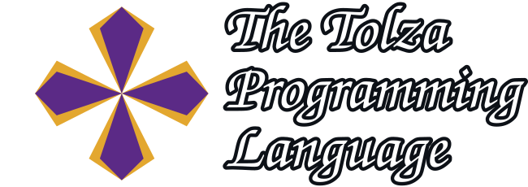

<div align = "center">

🇫🇷 



**Static composition, dynamic possibilities.**


</br>


*Memory explicit, behavior predictable.*

🛠️ 

</div>


Tolza is a statically typed, garbage-collector-free systems programming language designed for **deterministic, explicit, and secure code**.

It targets domains where control over memory, data access, and execution costs is critical:
game engines, simulation, embedded systems, runtimes, and deterministic backends.

Tolza deliberately avoids implicit behavior in favor of clarity, predictability, and compile-time guarantees.

> For technical implementation details, see the 

> For VSCode plugin, see [here](https://github.com/TheProgrammare/Tolza-VScode-Plugin)

## Why Tolza?

Modern systems languages each make different trade-offs:

- **C / C++** are expressive but unsafe by default and have a heavy legacy
- **Rust** is safe but relies on a global borrow checker and complex lifetime reasoning
- **Zig** is simple and explicit, but too permissive

Tolza explores a different approach:

> **Safety through explicit capabilities and static composition, without garbage collection or hidden heavy runtime behavior.**

## The name Tolza

**Tolza** is an old Occitan derivative of **Tolosa**, the Occitan name for Toulouse (France). Attested as early as the 12th century, *Tolza* could refer to **the land of Toulouse, its inhabitants, or even a Toulouse coin**. It derives from the medieval demonym *Tolosan/Tolosà*, meaning “a person from Tolosa,”. At its origin, **Tolosa** is itself a very ancient pre-Roman place name, predating the development of the Occitan language.

> The Tolza programming language was conceived in Toulouse, bringing this historical name into a modern technological context.


## Core Principles

### 1. No implicit behavior
Any operation with a cost or effect is **explicit in the code**, including:
- copying, cloning, and moving values
- mutation
- memory access
- synchronization and async boundaries

Nothing “just happens”.

> But there is some conventions to avoid the syntax boilerplate

### 2. Memory safety via explicit capabilities
Tolza does not use a garbage collector or a borrow checker.

Instead, it relies on a system of **explicit capabilities** that control:
- read access
- mutation (read/write access)
- lifetime validity

These rules are:
- local (no global inference)
- deterministic
- enforced at compile time

### 3. Static composition over inheritance
Tolza does not use classical object-oriented inheritance.

It favors **structural facet model (SFM)**:
- facets are set of variables
_ views are a package of facets
- forms are composed of facets
- rules operate on well-defined facet sets cases
- rule selection and data access are resolved at compile time

This avoids hidden polymorphism and runtime dispatch.


```
// speculative standard lib
facet BufferData<T> { data: ptr'T = nullptr, size: usize = 0, capacity: usize = 0 }
form Buffer<T> { use BufferData<T> }
rule populate<T>(items: [T; ..]) {
  BufferData<T>(buf) {
    buf->resize(items.size)
    for item in items {
      buf->add_item(item)
    }
  }
  return form // universal constructor if the form have BufferData facet
}
rule add_item<T>(item: T) {
  BufferData<T>(buf) {
    if buf.size >= buf.capacity && !this->resize() => return false
    buf.data[buf.size] = item
    buf.size += 1
    return true
  }
}

// user code
facet Item { ID: usize = -1 as usize, name: $str, amount: usize = 0 }
form Inventory { use BufferData<Item> }

fn main() {
  let apple = Item{0, "Apple", 10}
  let sword = Item{1, "Sword", 1}
  let player_inv = Inventory->populate({apple, sword})
  for i in 2..5 {
    let rand_item = Item{i, std::rand(0) as str, i * 2}
    player_inv->add_item(rand_item)
  }
}

```

### 4. Strong typing with explicit costs
Tolza makes value semantics explicit by distinguishing between:
- `copy`
- `ref` (immutable reference)
- `mut` (mutable reference)
- `move`

No duplication of data occurs implicitly.

This makes performance characteristics visible and auditable.

## A Simple Example

```tolza
faczt Vec2 {
    x: f32 = 0,
    y: f32 = 0,
}

fn length(mut v: Vec2) -> f32 {
    v.x **= 2
    v.y **= 3
    return math::sqrt(v.x * v.x + v.y * v.y)
}
```
In this example:
- no implicit allocation occurs
- no hidden copies are made
- mutation is allowed because explicitly stated

## Some Utilities
### 1. Async and Messaging (Overview)
Tolza provides an async model designed to remain:
- deterministic
- capability-safe
- free of implicit shared state

Async execution and message passing are explicit, and functions remain pure unless data is exposed through parameters and capabilities.

Full details are described in the language manifesto.

### 2. Small and Large Project Support

Tolza is designed to scale from small scripts to large projects:

- Modules can be imported/exported with full namespace isolation  
- Only the symbols actually used are imported  
- The compiler supports building projects composed of multiple scripts  
- Local variable name shadowing is prohibited

### 3. Native External Module Binder

Tolza allows the use of external code with minimal boilerplate and no name collisions:

- External functions, globals, and types from an imported library are automatically declared in a binding .json (see [FFI_JSON](docs/FFI_JSON.md)) 
- All operations on external elements are considered inherently unsafe  
- Anyone can write a .json binder, allowing other language communities to provide recommended bindings for Tolza  
- Currently, only C libraries are supported natively (use the ffi .json interface without any .json file)

> Only the C binder is compiler-native. A copy of the C binder script is included to illustrate the binding logic.

### Example: Using a C Library
```Tolza
import bind/C/stdio as C

fn main() {
  C::printf("Hello World !"c_str)
}
```
Explanation:
- `import bind/C/stdio` declares a binding to import
- `C::printf` references the language, then the script
- `as C` isolate the importation into the `C` namespace to use like `C::scanf(...)`
- The compiler generates a binding script linking the external function automatically

> The compiler requires access to the library code to generate the bindings (for C).

# What Tolza Is Not
- ❌ An object-oriented language
- ❌ A garbage-collected language
- ❌ A dynamic or scripting language
- ❌ A language killer (the C language and his lib is the ally of Tolza !)
- ❌ A language optimized for minimal syntax or beginner friendliness (it's depends of the approach)

Tolza prioritizes predictability and convenience.

# Project Status

Tolza is currently:
- in the design phase
- unstable and subject to change
- intended as both a practical language and a research platform

Major areas of exploration include:
- capability-based memory safety
- static composition models
- deterministic async systems

Documentation
- 📄 Examples: coming later
- 📘 Documentation: coming later
- 🔎 Reference: see [MANIFEST](MANIFEST.md)
- 🛠️ Toolchain: done (build in c++) 
- 🧮 Front-end Compiler: work in progress (build in C++)
- 🖥️ Back-end Compiler: LLVM-IR generation work in progress

# How to install

Go to Releases

Or build yourself:

1 - clone this repository
```bash
git clone https://github.com/TheProgrammare/Tolza.git
```

2 - install dependencies
check [dependencies](CONTRIBUTING_CODE.md#install-dependencies)

or

linux debian command
```bash
sudo apt install llvm cmake clang
```

3 - install command
- install toolchain `cd REPO_LOCATION/tolza/toolchain && cmake --preset release && cmake --install build/release`
- install compiler `cd REPO_LOCATION/tolza/compiler && cmake --preset release && cmake --install build/release`
