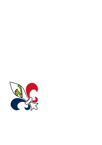

<div align = "center">

\- 🇬🇧🇺🇸  -



**Une composition statique, des possibilitées dynamiques.**

</br>


*Une mémoire explicite, un comportement prévisible.*

</div>

Velox est statiquement typé, système sans ramasse-miette, et conçus pour un **code déterministe, explicite et sécurisé**.  

Il vise les domaines où la contrôle mémoire, l'accès aux données et le coût de d'exécution sont critiques:
moteur de jeu, simulation, système embaqué, exécution temps réel et une dorsale déterministe.

Velox évite les comportements implicites pour des raisons de clarté, prédictibilité et des granranties vérifié à la compilation.

> Pour plus de détail sur l'implémentation techniques, consultez le  

## Pourquoi Velox ?

Les langages systèmes modernes ont tous des compromis:
- **C / C++** sont très expressif mais peu sécurisé par défaut
- **Rust** est sécurisé mais sa forte dépendance aux emprunts par vérification globale est difficile à suivre quotidiennement  
- **Zig** est simple et explicite, mais souvent trop permissif

Velox a une approche différente:

> **Sécurité au traver de capacité explicite et d'une composition statique, sans ramasse-miette ou comportement implicite à l'exécution.**

## Les Principes Fondamentaux

### 1. Pas de comportement implicite
Toute operation avec un coût ou effet est **explicite dans le code**, tel que:
- copie, clonage, déplacement de valeur
- mutation
- accès mémoire
- frontières de synchronisation et d'asynchronisation

Rien de "caché".

> Il existe cependant quelques conventions pour éviter la lourdeur syntaxique.

### 2. Sécurité Mémoire via les capacités explicites
Velox n'utilise pas de ramasse-miette ou un inspecteur d'emprunt.

À la place, il se base sur un système de **capacité explicites** qui contrôle:
- les lectures
- les mutations (lecture/écriture)
- validité de durée de vie (selon l'usage de l'origine et les nouvelles lectures/mutations déclarées)

Ces règles sont:
- locales (pas d'inférence global)
- déterministes
- établient à la compilation

### 3. Composition statique à la place de l'héritage
Velox n'utilise pas le paradigme classique orienté objet avec héritage de classe.

Il favorise la **compoisition statique (COP ou POC en Français)***
- les entitées sont composées de composants
- les systèmes opèrent sur des jeux de composants
- les chemin de résolution des systèmes et d'accès aux données sont résolus à la compilation

Cela évite le polymorphisme caché et la distribution durant le temps d'exécution par défaut.

> COP: Compositional Oriented Paradigm ou POC: Programmation Orienté Composition

### 4. Typage fort avec coût explicite
Velox rend les sémantiques de valeurs explicite en distinguant:
- `copy` (copie de valeur)
- `clone` (clonage de valeur)
- `ref` (référence immuable)
- `mut` (référence mutable)
- `move` (déplacement de valeur)

Pas de duplication de donnée ne s'effectue implicitement.

Cela rend les caractéristiques de performance visibles et auditables.

## Un exemple simple

```
comp Vec2 {
    x: f32 = 0,
    y: f32 = 0,
}

fn length(ref v: Vec2) -> f32 {
    return math::sqrt(v.x * v.x + v.y * v.y)
}
```
Dans cet exemple:
- pas d'allocation implicite n'a lieu
- aucune copie cachée n'est réalisée
- la mutation n'est pas autorisée si cela n'est pas explicitement défini

## Quelques Utilitaires
### 1. L'Asynchronisation et les Messages (Aperçu)
Velox propose un modèle asynchrone qui demeure:
- déterministe
- capacités-sûr 
- libre de tout état partagé implicite

L'exécution asynchrone et les passages de messages sont explicites, et les fonctions demeurent pure tant que les données sont exposée au travers des paramètres et capacités. 

Tous les détails sont décrit dans le manifeste du langage.

### 2. Support des Petits et Grands Projets

Velox est conçus pour passer de petits scripts à de grands projets:
- Les modules peuvent êtrent importés/exportés avec une isolation totale de son espace de nom
- Seul les symboles utilités sont importés
- Le compilateur supporte la construction de projet multi-script
- L'obscurcisation des noms de variable locale est interdit 

### 3. Liaison Natif des Modules Externes

Velox permet d'utiliser du code externe avec un minimum de code et sans collision de nom:
- Les fonctions externes, globales et types depuis une librairie importé sont automatiquement déclaré dans un script de liaison
- Toutes les opérations sur des élements externes sont intrinsèquement considérés comme dangereux
- Des plug
- Des module optionals au compilateur peuvent générer des liaisons depuis d'autres langages, permettant aux communautés de ces autres langages de proposer et recommander des liaisons pour Velox
- Actuellement, seul les librairies C sont supporté nativement  

> Seul la liaison C est natif au compilateur. Une copie du script de la liaison du C est incluse pour illustrer la logique de liaison. 

### Exemple: Usage de la Librairie C
```
  import extern C::stdio

  fn main() {
    C::printf("%s", "Hello World")
  }
```
Explications:
- `import extern C::stdio` déclare la librairie externe à importer
- `C::printf` référence la fonction dans la librairie en utilisant l'espace de nom du langage
- Le compilateur génère automatiquement un script de liaison relié aux fonctions externes 

> Le compilateur demande un accès aux librairies pour générer les liaisons.

# Ce que Velox n'est pas
- ❌ Un langage orienté object
- ❌ Un langage avec ramasse-miette
- ❌ Un langage dynamique ou à scriptage
- ❌ Un langage optimisé pour une syntaxe minimale ou destiné aux débutants (cela dépend de l'approche)

Velox priorise la prédictabilité et la justesse avec un assez bon confort d'usage

# État du Projet

Velox est actuellement :
- en phase de conception
- instable et sujet aux changements
- entendus comme à la fois un langage à pratiquer et un espace de recherche

Les zones d'explorations majeurs incluent:
- Les capacités et la sécurité mémoire
- Les modèles de composition statique
- Les systèmes d'asynchronisation 

Documentation
- 📘 Manifeste du langage et détail technique: 
- 📄 Exemples: plus tard
- 🛠️ Compilation premier-plan: en cours (écrit en C++)
- 🖥️ Compilation arriège-plan: génération LLVM-IR en cours
- 🔍 Colorisation syntaxique: fait (VS Code)
- 📜 Extrait de code: fait (VS Code)
