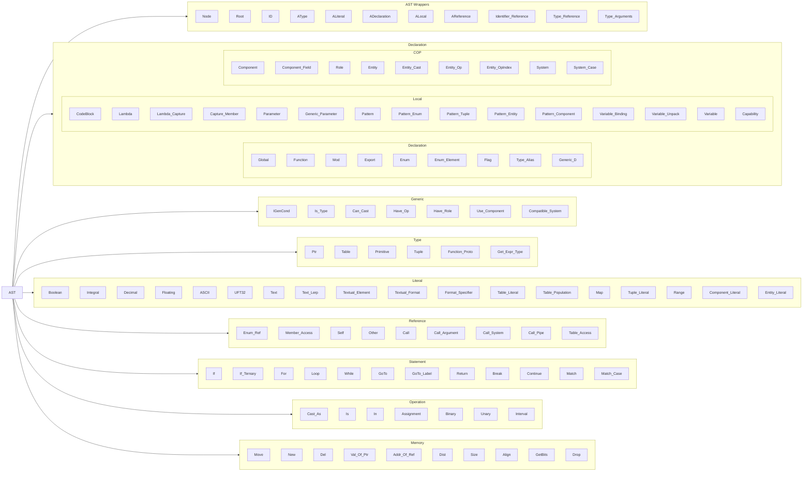

### AST categories

```mermaid
%% Orientation horizontale pour gagner de la place
graph LR
    AST[AST]

    %% Types de base
    AST --> Types[Types généraux]
    AST --> Declaration
    AST --> Generic_NS[Generic]
    AST --> Type_NS[Type]
    AST --> Literal_NS[Literal]
    AST --> Reference_NS[Reference]
    AST --> Statement_NS[Statement]
    AST --> Operation_NS[Operation]
    AST --> Memory_NS[Memory]

    %% Types généraux
    subgraph Types [AST Wrappers]
        Node
        Root
        ID
        AType
        ALiteral
        ADeclaration
        ALocal
        AReference
        Identifier_Reference
        Type_Reference
        Type_Arguments
    end

    %% Declaration
    subgraph Declaration [Declaration]
        direction LR
        subgraph DeclarationBase [Declaration]
          Global
          Function
          Mod
          Export
          Enum
          Enum_Element
          Flag
          Type_Alias
          Generic_D
        end
        subgraph Local [Local]
            direction TB
            CodeBlock
            Lambda
            Lambda_Capture
            Capture_Member
            Parameter
            Generic_Parameter
            Pattern
            Pattern_Enum
            Pattern_Tuple
            Pattern_Entity
            Pattern_Component
            Variable_Binding
            Variable_Unpack
            Variable
            Capability
        end
        subgraph COP [COP]
            direction TB
            Component
            Component_Field
            Role
            Entity
            Entity_Cast
            Entity_Op
            Entity_OpIndex
            System
            System_Case
        end
    end

    %% Generic
    subgraph Generic_NS [Generic]
        IGenCond
        Is_Type
        Can_Cast
        Have_Op
        Have_Role
        Use_Component
        Compatible_System
    end

    %% Type
    subgraph Type_NS [Type]
        Ptr
        Table
        Primitive
        Tuple
        Function_Proto
        Get_Expr_Type
    end

    %% Literal
    subgraph Literal_NS [Literal]
        Boolean
        Integral
        Decimal
        Floating
        ASCII
        UFT32
        Text
        Text_Lerp
        Textual_Element
        Textual_Format
        Format_Specifier
        Table_Literal
        Table_Population
        Map
        Tuple_Literal
        Range
        Component_Literal
        Entity_Literal
    end

    %% Reference
    subgraph Reference_NS [Reference]
        Enum_Ref
        Member_Access
        Self
        Other
        Call
        Call_Argument
        Call_System
        Call_Pipe
        Table_Access
    end

    %% Statement
    subgraph Statement_NS [Statement]
        If
        If_Ternary
        For
        Loop
        While
        GoTo
        GoTo_Label
        Return
        Break
        Continue
        Match
        Match_Case
    end

    %% Operation
    subgraph Operation_NS [Operation]
        Cast_As
        Is
        In
        Assignment
        Binary
        Unary
        Interval
    end

    %% Memory
    subgraph Memory_NS [Memory]
        Move
        New
        Del
        Val_Of_Ptr
        Addr_Of_Ref
        Dist
        Size
        Align
        GetBits
        Drop
    end

```
