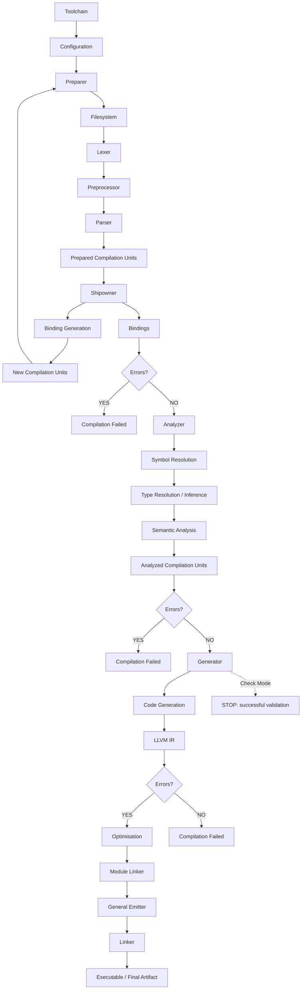

# Pipeline graph

```mermaid
flowchart TD
    A[Toolchain] --> B[Configuration]
    B --> C[Preparer]

    C --> C1[Filesystem]
    C1 --> C2[Lexer]
    C2 --> C3[Preprocessor]
    C3 --> C4[Parser]
    C4 --> D[Prepared Compilation Units]

    D --> E[Shipowner]

    E --> E1[Binding Generation]
    E1 --> E2[New Compilation Units]
    E2 --> C

    E --> F[Bindings]
    F --> G{Errors?}

    G -- YES --> X[Compilation Failed]
    G -- NO --> H[Analyzer]

    H --> H1[Symbol Resolution]
    H1 --> H2[Type Resolution / Inference]
    H2 --> H3[Semantic Analysis]
    H3 --> I[Analyzed Compilation Units]
    I --> P{Errors?}
    
    P -- YES --> O1[Compilation Failed]
    P -- NO --> J[Generator]

    J --> J1[Code Generation]
    J1 --> J2[LLVM IR]
    J2 --> Q{Errors?}

    Q -- YES --> J3[Optimisation]
    Q -- NO --> J4[Compilation Failed]

    J3 --> K[Module Linker]
    K --> L[General Emitter]
    L --> M[Linker]
    M --> N[Executable / Final Artifact]

    J -. Check Mode .-> O[STOP: successful validation]
```
