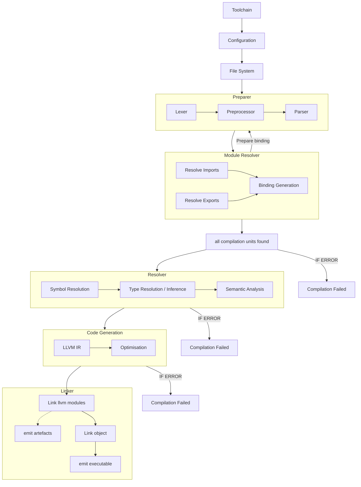

# Pipeline graph

```mermaid
flowchart TB
    A[Toolchain] --> B[Configuration]
    B --> FS[File System]
    FS --> C
    subgraph E[Module Resolver]
        E2[Resolve Exports]
        E3[Resolve Imports]
        E3 --> E4[Binding Generation]
        E2 --> E4
    end
    subgraph C[Preparer]
        C2[Lexer]
        C2 --> C3[Preprocessor]
        C3 --> C4[Parser]
    end

    C --> E
    E -- Prepare binding --> C

    E --> F[all compilation units found]
    F -- IF ERROR --> X[Compilation Failed]
    F --> H

     subgraph H[Resolver]
        H1[Symbol Resolution]
        H1 --> H2[Type Resolution / Inference]
        H2 --> H3[Semantic Analysis]
    end

    H --> J
    H -- IF ERROR --> X1[Compilation Failed]

    subgraph J[Code Generation]
        J1[LLVM IR]
        J1 --> J2[Optimisation]
    end

    J --> L
    J -- IF ERROR --> X2[Compilation Failed]
    
    subgraph K[Linker]
        L[Link llvm modules]
        L .-> L1[emit artefacts]
        L --> L2[Link object]
        L2 --> L3[emit executable]
    end
```
