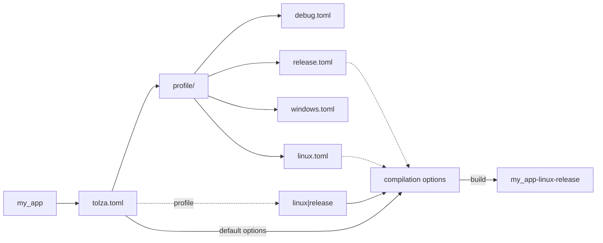

# Profile

Profiles are located at `profile/` folder

Profiles are composition of compilation options

The `main` profile is `your_project/tolza.toml`

Define build profiles inside `your_project/tolza.toml` at root section `profile`. Set only the profile filename contained inside `profile/` folder

> It's possible to define a composition of profiles: `profile = "linux|posix|release"`

The composition will impact the build file name and executable file name :

e.g. `profile = "windows"` -> `my_app-windows`, `profile = "linux|arm"`, `my_app-linux-arm`

## Profile composition

