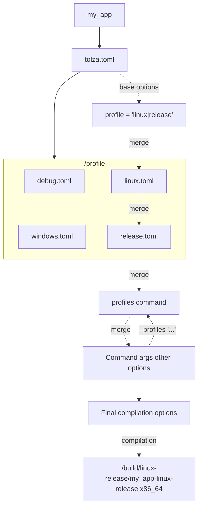

# Profile

Profiles are located at `profile/` folder.

Profiles are collections of compilation options.

The project's base configuration is `your_project/tolza.toml`. It defines the default compilation options and the project's configuration. Profiles located in `profile/` override or extend these defaults.

Define build profile composition in the root `profile` field of `your_project/tolza.toml`. Profiles names must correspond to files in the `profile/` folder.

> It's possible to define a composition of profiles: `profile = "linux|posix|release"`

The composition affects the build file name and executable file name :

e.g. `profile = "windows"` -> `my_app-windows`, `profile = "linux|arm"` -> `my_app-linux-arm`

> The composition order affects the final configuration. Profiles are applied from left to right. When multiple profiles override the same option, the value from the last applied profile takes precedence.

> For fine-grained profile composition, profiles can define options that are disabled by default. Uncommenting or enabling these options allows them to participate in the composition. Merge modes can also be specified for selected option sets.

## Profile composition

